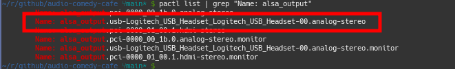
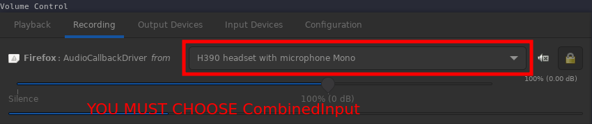

# ACC: Audio Comedy Café

Add a touch of humor and entertainment to virtual meetings and calls. In the age of remote work and digital communication, it's essential to maintain team morale and engagement, and what better way to do that than sharing funny audio moments with your colleagues or friends?

It utilizes the PulseAudio sound server to merge different audio inputs, enabling us to achieve this. We're also incorporating the use of mplayer to play the selected audio clips and the xbindkeys project to configure convenient hotkeys for triggering the audios.

Thanks to [this](https://www.reddit.com/r/archlinux/comments/rlpaj9/pulseaudio_redirecting_audio_file_to_input) Reddit thread, we were able to discover some valuable tricks.

## Requirements
- Pulseaudio
- mplayer
- pavucontrol
- xbindkeys

You can verify if you meet these requirements by running:

```bash
ps aux | grep pulseaudio # It should return the status of the running PulseAudio.
which pactl # It should return the path of pactl.
which mplayer # It should return the path of mplayer.
which xbindkeys # It should return the path of xbindkeys.
```

## Install required softwares

```bash
sudo apt install -y pavucontrol mplayer xbindkeys
```

## Clone this repository

```bash
mkdir ~/github/ && cd ~/github
git clone https://github.com/thiagosanches/audio-comedy-cafe.git
```


## Check your input devices

To make this work, we need to identify your **input** device, which refers to your microphone. Please pay close attention to the results, especially if you're using an external microphone, a USB headset, or earphones with a jack plug, as you'll need to select the correct values.

```bash
pactl list | grep "Name: alsa_input"
```

In the image below, you can see that I have three possible **inputs** (microphones):


In this example, I'll choose the third one: `alsa_input.usb-Logitech_USB_Headset_Logitech_USB_Headset-00.mono-fallback`.

## Check your output devices

At times, the list of devices may be longer than the available input devices, especially when using monitors with HDMI output capable of transmitting audio. However, typically, you should select the value that corresponds to the speakers of your headset or earphones.


```bash
pactl list | grep "Name: alsa_output"
```

In my case, I'll opt for `alsa_output.usb-Logitech_USB_Headset_Logitech_USB_Headset-00.analog-stereo`.



## Loading pulseaudio modules

This is the crucial step that ensures everything works. We're loading specific modules using `pactl` to combine the microphone and the output. This enables us to listen to the playback while the audio is playing during the call.


```bash
MIC="alsa_input.usb-Logitech_USB_Headset_Logitech_USB_Headset-00.mono-fallback"
OUT="alsa_output.usb-Logitech_USB_Headset_Logitech_USB_Headset-00.analog-stereo"
IDS="/tmp/soundboard.txt"

pactl load-module module-null-sink channel_map=front-left,front-right sink_name=SoundBoard >> "${IDS}"
pactl load-module module-null-sink sink_name=CombinedInput sink_properties=device.description="CombinedInput" >> "${IDS}"

pactl load-module module-loopback source=SoundBoard.monitor sink="${OUT}" latency_msec=1 >> "${IDS}"
pactl load-module module-loopback source=SoundBoard.monitor sink=CombinedInput latency_msec=1 >> "${IDS}"
pactl load-module module-loopback source="${MIC}" sink=CombinedInput latency_msec=1 >> "${IDS}"
pactl set-source-volume SoundBoard.monitor 50000
pactl set-source-volume "${MIC}" 60000
pactl set-default-source CombinedInput.monitor
```

You can find these commands in the [load.sh](./load.sh) file.

**Note**: Run that script only once!

And that's it! You're all set to start using it! The following steps will assist you in configuring hotkeys and provide guidance on potential issues we've encountered during this process.

## Configure xbindkeys

**Important**: Please take note of this. If you already have a configuration for xbindkeys, do not run the following command, as it will result in the loss of your existing settings. This step is necessary only for users who have never configured xbindkeys before.

```bash
xbindkeys --defaults > /home/$USER/.xbindkeysrc
```

A sample file will be generated, and all you need to do is add your own hotkeys for the audio clips. An example will be provided below.


## Configuration file example

```bash
"/home/user/github/audio-comedy-cafe/play.sh /home/user/github/audio-comedy-cafe/audio1.mp3"
    Control+Shift+1
"/home/user/github/audio-comedy-cafe/play.sh /home/user/github/audio-comedy-cafe/audio2.mp3"
    Control+Shift+2
```

Update the `user` value in the path to match your own username.

**Note**: If you wish to use a different key combination, you can utilize the following command. It will open an X11 utility that allows you to select and display the key or key combination you want by focusing on it and pressing the desired key.


## Start/restarting xbindkeys

Whenever you modify your keybindings, remember to restart xbindkeys.

```bash
pkill -HUP xbindkeys && xbindkeys
```

## Important

If you've noticed, the final command in the 'Loading PulseAudio Modules' section has already configured the CombinedInput (Microphone + Speaker) as the default source:

```bash
pactl set-default-source CombinedInput.monitor
```

In other words, if you're already in a meeting, it will automatically switch the microphone to that 'device,' and things will function as expected.

However, if you ran that command without being in a meeting, this is where pavucontrol becomes useful. It allows you to select the CombinedInput as your recording device for the application in which you're conducting your meeting, such as Discord, Google Chrome, Mozilla Firefox, and so on.



This is true if your meeting has ended and you've started a new one. You'll need to switch it again in the new meeting. Additionally, if you shut down your computer, you'll need to run the [load.sh](./load.sh) script again.
